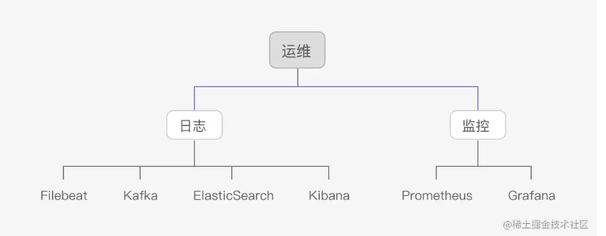

# gotalk
分布式IM项目，即时通讯系统，允许两人或者多人使用网络实时的传递文字、图像、语言来交流。

## 核心功能：
### 一、通信服务
通信服务是整个系统的`心脏`
1. 支持TCP/webSocket协议的接入
2. 实现登录、登出、同账号互踢等
3. 单聊：一对一聊天
4. 群聊：一对多聊天
5. 离线信息
6. 敏感词：非法词语过滤原理
7. 群管理：
    + 创建群
    + 群详细
    + 进群
    + 退群
    + 成员列表

### 二、Web服务
主要功能
1. 授权服务
2. 用户管理
    + 创建用户
    + 查询详情

### ？、进阶功能
1. 测试：
    + 单元测试：通过覆盖测试确保逻辑可靠。
   + 基准测试：测试登录、单聊、群聊性能。
2. 性能优化：从内存、GC、缓冲等方面优化系统。
3. 智能路由：介绍长连服务前端的路由与负载逻辑。
4. 多租户：介绍多租户实现原理及服务隔离。
5. 灰度发布：介绍灰度发布系统的原理及实战。
6. 部署架构：介绍分布式部署架构及要点。

### 运维

1. 日志系统
    + 程序日志
    + 业务日志：如登录、退出等事件
2. 监控报警系统
    + 机器监控：CPU、内存、磁盘等
    + 服务监控：比在线用户、请求时长、GC、占用内存、线程数、转发流量等。

## 技术栈
+ 分布式唯一Id `github.com/bwmarrin/snowflake`
+ rpc框架：grpc/rest
+ 序列化框架：json/protobuf
+ websocket：gobwas
+ orm框架：gorm
+ 中间件：
  + 数据库：mysql || TiDB || Clickhouse
  + 缓存：redis（哨兵模式/集群模式）、运维系统-`cachecloud`
  + 注册中心：分两个类型`CP`（保证数据一致型）||`AP`（保证服务可用性），---ETCD、Consul、Nacos等 || Eureka
  + 配置中心：viper
  + 文件存储：OSS
## TODO
1. 音视频通话
2. 会议模式